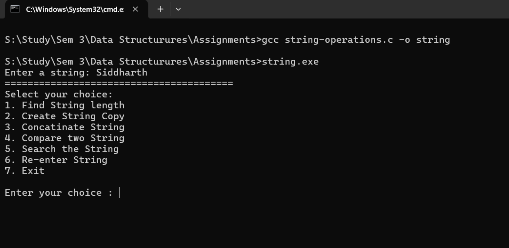

# String Operations
The assignment consist of implimentation of basic string operations without the usage of inbuilt string functions.
## Operations Performed
1. Find String length
2. Create String Copy
3. Concatinate String
4. Compare two String
5. Search the String

## Implimentation
1. For this task firstly the user was asked to enter a string and then a choice based menu was created for the user to select operations to be performed.
2. user defined functions were created for every string operation.
3. functions were called inside switch cases.

## Output
